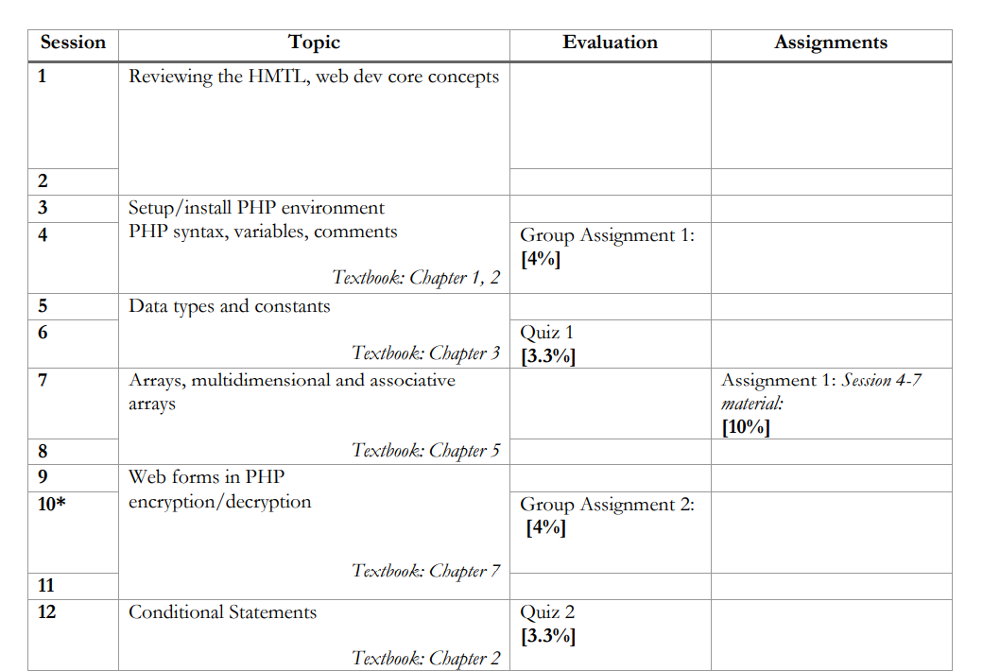

# WEB DEVELOPMENT WITH PHP
Web development with PHP 

# Repository Structure 
The repository is split by chapter or topic. 

# Running Examples from Class 
Code should be run from the `htdocs` folder in the `XAMP` setup. We will install this in the first weeks of course. 

# Our class schedule

Our first twelve weeks schedule.